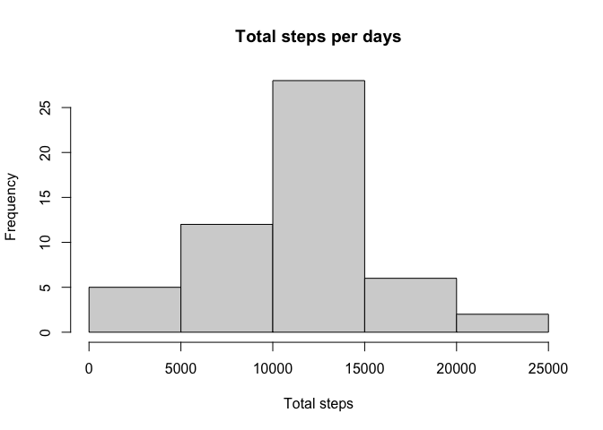
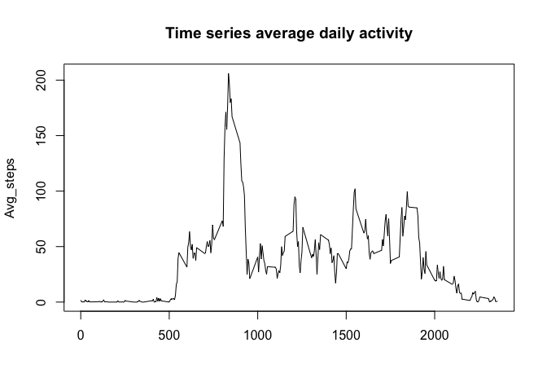
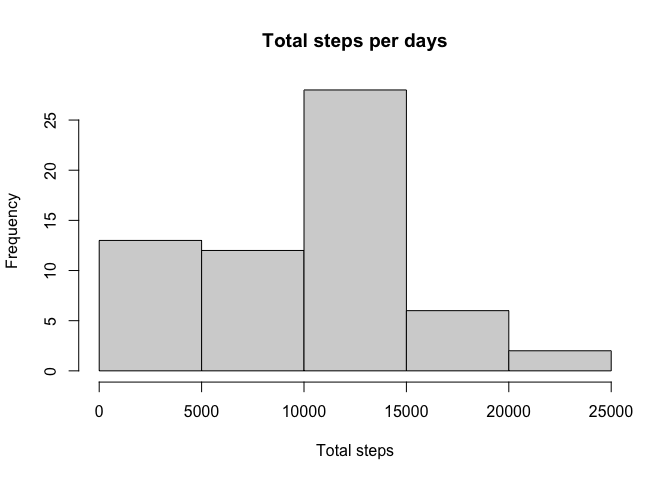
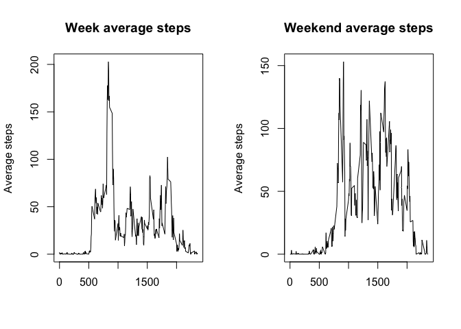

## 1. Code for reading the files and processing the data


```r
df<-read.csv('activity.csv',header=TRUE, sep=",")
df$date<-as.Date(df$date)
data<-subset(df,!is.na(steps))
```

## 2. Histogram of the total number of steps taken each day


```r
total_steps_day<-tapply(data$steps,data$date,sum)
hist(total_steps_day,xlab="Total steps",main="Total steps per days")
```

<!-- -->

## 3. Average and median values 


```r
avg_steps_day<-tapply(data$steps,data$date,mean)
median_steps_day<-tapply(data$steps,data$date,median)

avg_steps_day
```

2012-10-02 2012-10-03 2012-10-04 2012-10-05 2012-10-06 2012-10-07 2012-10-09 
 0.4375000 39.4166667 42.0694444 46.1597222 53.5416667 38.2465278 44.4826389 
2012-10-10 2012-10-11 2012-10-12 2012-10-13 2012-10-14 2012-10-15 2012-10-16 
34.3750000 35.7777778 60.3541667 43.1458333 52.4236111 35.2048611 52.3750000 
2012-10-17 2012-10-18 2012-10-19 2012-10-20 2012-10-21 2012-10-22 2012-10-23 
46.7083333 34.9166667 41.0729167 36.0937500 30.6284722 46.7361111 30.9652778 
2012-10-24 2012-10-25 2012-10-26 2012-10-27 2012-10-28 2012-10-29 2012-10-30 
29.0104167  8.6527778 23.5347222 35.1354167 39.7847222 17.4236111 34.0937500 
2012-10-31 2012-11-02 2012-11-03 2012-11-05 2012-11-06 2012-11-07 2012-11-08 
53.5208333 36.8055556 36.7048611 36.2465278 28.9375000 44.7326389 11.1770833 
2012-11-11 2012-11-12 2012-11-13 2012-11-15 2012-11-16 2012-11-17 2012-11-18 
43.7777778 37.3784722 25.4722222  0.1423611 18.8923611 49.7881944 52.4652778 
2012-11-19 2012-11-20 2012-11-21 2012-11-22 2012-11-23 2012-11-24 2012-11-25 
30.6979167 15.5277778 44.3993056 70.9270833 73.5902778 50.2708333 41.0902778 
2012-11-26 2012-11-27 2012-11-28 2012-11-29 
38.7569444 47.3819444 35.3576389 24.4687500 

```r
median_steps_day
```

2012-10-02 2012-10-03 2012-10-04 2012-10-05 2012-10-06 2012-10-07 2012-10-09 
         0          0          0          0          0          0          0 
2012-10-10 2012-10-11 2012-10-12 2012-10-13 2012-10-14 2012-10-15 2012-10-16 
         0          0          0          0          0          0          0 
2012-10-17 2012-10-18 2012-10-19 2012-10-20 2012-10-21 2012-10-22 2012-10-23 
         0          0          0          0          0          0          0 
2012-10-24 2012-10-25 2012-10-26 2012-10-27 2012-10-28 2012-10-29 2012-10-30 
         0          0          0          0          0          0          0 
2012-10-31 2012-11-02 2012-11-03 2012-11-05 2012-11-06 2012-11-07 2012-11-08 
         0          0          0          0          0          0          0 
2012-11-11 2012-11-12 2012-11-13 2012-11-15 2012-11-16 2012-11-17 2012-11-18 
         0          0          0          0          0          0          0 
2012-11-19 2012-11-20 2012-11-21 2012-11-22 2012-11-23 2012-11-24 2012-11-25 
         0          0          0          0          0          0          0 
2012-11-26 2012-11-27 2012-11-28 2012-11-29 
         0          0          0          0 

## 4. Time series plot of the average number of steps taken


```r
avg_steps_interval<-tapply(data$steps,data$interval,mean)
plot(unique(data$interval),avg_steps_interval,type="l",xlab="",ylab="Avg_steps",main="Time series average daily activity")
```

<!-- -->

## 5. Interval with the most steps in the day


```r
data$interval[which.max(data$steps)]
```

[1] 615

## 6. Cleaning the full data frame


```r
try<-df$steps
try[is.na(try)]<-0
newdata<-df
newdata$steps<-try
```

## 7. Histogram with the full dataframe


```r
total_steps_day_new<-tapply(newdata$steps,newdata$date,sum)
hist(total_steps_day_new,xlab="Total steps",main="Total steps per days")
```

<!-- -->


```r
avg_steps_day_new<-tapply(newdata$steps,newdata$date,mean)
median_steps_day_new<-tapply(newdata$steps,newdata$date,median)
avg_steps_day_new
```

2012-10-01 2012-10-02 2012-10-03 2012-10-04 2012-10-05 2012-10-06 2012-10-07 
 0.0000000  0.4375000 39.4166667 42.0694444 46.1597222 53.5416667 38.2465278 
2012-10-08 2012-10-09 2012-10-10 2012-10-11 2012-10-12 2012-10-13 2012-10-14 
 0.0000000 44.4826389 34.3750000 35.7777778 60.3541667 43.1458333 52.4236111 
2012-10-15 2012-10-16 2012-10-17 2012-10-18 2012-10-19 2012-10-20 2012-10-21 
35.2048611 52.3750000 46.7083333 34.9166667 41.0729167 36.0937500 30.6284722 
2012-10-22 2012-10-23 2012-10-24 2012-10-25 2012-10-26 2012-10-27 2012-10-28 
46.7361111 30.9652778 29.0104167  8.6527778 23.5347222 35.1354167 39.7847222 
2012-10-29 2012-10-30 2012-10-31 2012-11-01 2012-11-02 2012-11-03 2012-11-04 
17.4236111 34.0937500 53.5208333  0.0000000 36.8055556 36.7048611  0.0000000 
2012-11-05 2012-11-06 2012-11-07 2012-11-08 2012-11-09 2012-11-10 2012-11-11 
36.2465278 28.9375000 44.7326389 11.1770833  0.0000000  0.0000000 43.7777778 
2012-11-12 2012-11-13 2012-11-14 2012-11-15 2012-11-16 2012-11-17 2012-11-18 
37.3784722 25.4722222  0.0000000  0.1423611 18.8923611 49.7881944 52.4652778 
2012-11-19 2012-11-20 2012-11-21 2012-11-22 2012-11-23 2012-11-24 2012-11-25 
30.6979167 15.5277778 44.3993056 70.9270833 73.5902778 50.2708333 41.0902778 
2012-11-26 2012-11-27 2012-11-28 2012-11-29 2012-11-30 
38.7569444 47.3819444 35.3576389 24.4687500  0.0000000 

```r
median_steps_day_new
```

2012-10-01 2012-10-02 2012-10-03 2012-10-04 2012-10-05 2012-10-06 2012-10-07 
         0          0          0          0          0          0          0 
2012-10-08 2012-10-09 2012-10-10 2012-10-11 2012-10-12 2012-10-13 2012-10-14 
         0          0          0          0          0          0          0 
2012-10-15 2012-10-16 2012-10-17 2012-10-18 2012-10-19 2012-10-20 2012-10-21 
         0          0          0          0          0          0          0 
2012-10-22 2012-10-23 2012-10-24 2012-10-25 2012-10-26 2012-10-27 2012-10-28 
         0          0          0          0          0          0          0 
2012-10-29 2012-10-30 2012-10-31 2012-11-01 2012-11-02 2012-11-03 2012-11-04 
         0          0          0          0          0          0          0 
2012-11-05 2012-11-06 2012-11-07 2012-11-08 2012-11-09 2012-11-10 2012-11-11 
         0          0          0          0          0          0          0 
2012-11-12 2012-11-13 2012-11-14 2012-11-15 2012-11-16 2012-11-17 2012-11-18 
         0          0          0          0          0          0          0 
2012-11-19 2012-11-20 2012-11-21 2012-11-22 2012-11-23 2012-11-24 2012-11-25 
         0          0          0          0          0          0          0 
2012-11-26 2012-11-27 2012-11-28 2012-11-29 2012-11-30 
         0          0          0          0          0 

## 8. Comparison between steps in weekdays and in the weekend


```r
newdata$day<-weekdays(newdata$date)
i=1
l<-c(1:length(try))
for(i in l){
if (newdata$day[i]=="Sabato" | newdata$day[i]=="Domenica"){
  newdata$weekday[i]<-0
  newdata$weekend[i]<-1
}
else{
  newdata$weekday[i]<-1
  newdata$weekend[i]<-0
}
  i=i+1
}

newdata_week<-subset(newdata,weekday==1)
newdata_weekend<-subset(newdata,weekend==1)
avg_steps_week<-tapply(newdata_week$steps,newdata_week$interval,mean)
avg_steps_weekend<-tapply(newdata_weekend$steps,newdata_weekend$interval,mean)

par(mfrow=c(1,2))
plot(unique(newdata$interval),avg_steps_week,type="l",xlab="",ylab="Average steps",main="Week average steps")
plot(unique(newdata$interval),avg_steps_weekend,type="l",xlab="",ylab="Average steps",main="Weekend average steps")
```

<!-- -->

